# Occasionally Divine


*A god-simulator where the kingdom **remembers** — powered by a [Cognee](https://www.cognee.ai) knowledge graph.*

You are the invisible god of a struggling medieval kingdom. Each season brings a crisis; you answer with miracles, subtle nudges, wrathful judgments — or silence. The twist: **nothing is forgotten.** Every choice is woven into a knowledge graph, and the world generates its future out of its memory of you.


## Contents

- [Why memory is the game](#why-memory-is-the-game)
- [Features](#features)
- [In motion](#in-motion)
- [Screenshots](#screenshots)
- [Project structure](#project-structure)
- [Architecture](#architecture)
- [Cost-engineering](#cost-engineering-its-a-paid-api)
- [API overview](#api-overview)
- [Running it](#running-it)
- [Tech](#tech)
- [Known limitations / roadmap](#known-limitations--roadmap)
- [License](#license)

## Why memory is the game

Most LLM games have goldfish memory: every scene is generated fresh, so nothing you do matters for long. *Occasionally Divine* inverts that — the memory **is** the gameplay:

- **Causal chains.** Crises descend from earlier crises. A drought you ignored becomes a famine, becomes a witch hunt, becomes a zealot uprising — each new situation carries a `⟴ CONSEQUENCE` badge naming its ancestor, and the full chain is browsable as a tree in the **Tapestry of Fate**.
- **Adaptations that actually protect.** When unrest boils over, the Council of Elders convenes, debates (in character, holding grudges retrieved from the graph), and builds an adaptation — drainage canals, granaries, watch posts. Seasons later, when a matching calamity strikes, the adaptation **mechanically halves the damage** and the UI celebrates it:


- **Rumors that evolve into legends.** Each crisis seeds a rumor among the commoners. Rumors link to parent rumors, mutate across seasons, and can eventually culminate as real crises — a fabled beast "discovered," a cult uprising, a witch trial.
- **Elders who catch on.** Five elders with persistent personalities, moods, and beliefs. Their suspicion that *something unseen is manipulating the kingdom* is tracked in the graph and slowly surfaces in council debates. They're talking about **you**.
- **Transparent retrieval.** Every situation ships with an **"Echoes of the Past"** panel showing the raw memories Cognee retrieved to generate it — the graph's work is visible, not vibes.

## Features

- **Validated causal graph** — the LLM declares a `parent_situation_id` for each new crisis; hallucinated/nonexistent IDs are rejected server-side before they can corrupt the chain.
- **Deterministic consequence mechanics** — completed adaptations reduce matching-category crisis damage in game code, not by trusting the LLM to remember what it built.
- **243 possible Council personalities** — 5 elders × 3 personality variants each (pragmatic/fanatic/weary archetypes with distinct stances and belief levels), so council debates don't repeat the same voice twice.
- **Free-text Oracle** — a `/api/oracle` endpoint answers arbitrary player questions grounded purely in retrieved graph memories, refusing to invent history the graph doesn't contain.
- **On-demand elder dossiers** — per-elder biography and grudge/alliance summaries generated from `elder_history` and `relationship_history` retrievals.
- **Refresh-proof sessions** — situations persist through `sessionStorage` + SQL so a page reload never re-bills a paid generation call.

## In motion

The Council debates in character — grudges and all — then proposes an adaptation drawn straight from the graph:


Ask the Oracle of the Archives anything; it answers from the same graph the game plays out of:


## Screenshots

<details>
<summary>More of the interface — the dashboard, seasonal turns, the council, and the archive (click to expand)</summary>

| | |
|---|---|
|  |  |
|  |  |
|  |  |
|  |  |
|  | |

</details>

## Project structure

No frontend build step, no ORM migrations framework, no framework-generated boilerplate — every file below does real work:

```
backend/
├── main.py                  # FastAPI app: world_state, causality_timeline, elder_dossier, memory, oracle, reset
├── models/
│   ├── domain.py             # SQLAlchemy models: Kingdom, Situation, Elder, Rumor, Adaptation, Chronicle, CouncilMeeting
│   └── cognee_schemas.py      # Pydantic memory schemas (SituationMemory, AdaptationMemory, …) with to_sentence()
├── services/
│   ├── db.py                 # Engine/session setup, init_db seeds a fresh Kingdom + 5 Elders
│   ├── simulation.py          # Seasonal stat drift
│   ├── situation_engine.py    # Generates crises + interventions from SQL state + Cognee retrieval
│   ├── action_handler.py      # Applies a chosen intervention's effects to kingdom state
│   ├── memory.py              # All Cognee integration: add/cognify/recall, batched cognify, retrieval capping
│   ├── llm_client.py          # Gemini calls via LiteLLM + defensive JSON parsing
│   └── utils.py               # Thresholds/constants (e.g. council trigger unrest ≥ 70)
├── council/engine.py          # Council of Elders: trigger, in-character debate, adaptation proposal
├── prompts/council.py         # Council system prompt
├── api/
│   ├── actions.py             # POST /generate_situation, /execute_intervention
│   └── council.py             # POST /trigger_council, /resolve_council
└── data/minor_cards.py        # Flavor/minor event card data

frontend/
├── index.html                # Single-page shell: title screen, stat ribbon, council/oracle/tapestry modals
├── app.js                    # Game state object, fetch calls to the API, all DOM rendering
├── atmosphere.js              # Canvas-based ambient background effects
└── styles.css                 # "Majestic Paranoia" design system (CSS custom properties, no build step)
```

## Architecture

Two memory systems, deliberately split — like a mind:

```mermaid
flowchart LR
    subgraph Conscious["Conscious mind — SQL (SQLite + SQLAlchemy)"]
        K[Kingdom state<br/>stats · weather · omens]
        S[Situations<br/>parent_situation_id chains]
        E[Elders · Rumors · Adaptations<br/>Chronicle · Council meetings]
    end

    subgraph Subconscious["Subconscious — Cognee knowledge graph (kuzu + lancedb)"]
        D1[kingdom_history]
        D2[elder_history]
        D3[rumor_history]
        D4[disaster_history]
        D5[relationship_history]
        D6[external_world_history]
    end

    P[Pydantic memory schemas<br/>SituationMemory · AdaptationMemory<br/>ElderActionMemory · RumorMemory · …] -- "to_sentence() → cognee.add()" --> Subconscious
    Conscious --> P
    Subconscious -- "targeted natural-language<br/>interrogations at generation time" --> G[Situation Engine /<br/>Council Engine<br/>Gemini 2.5 Flash]
    Conscious --> G
    G -- "validated causal links,<br/>new state, new memories" --> Conscious
```



**The flow, per turn:**

1. **Generate** — the Situation Engine pulls SQL state (stats, recent events, active rumors) *plus* targeted Cognee interrogations chosen by game state (low food → famine history; high unrest → dissent history; storms → disaster history). Recent situation IDs are injected so the LLM can declare a **validated** causal parent (`parent_situation_id`) — hallucinated IDs are rejected before persisting.
2. **Intervene** — the player picks one of four responses (miracle / nudge / wrath / nothing). Effects apply to SQL state; **completed adaptations matching the crisis category mechanically dampen the harm** — no trusting the LLM to remember.
3. **Remember** — the resolution is written back as structured Pydantic memories rendered to natural-language sentences (`SituationMemory`, with its ID and its parent's ID) so the graph accumulates *causal*, ID-bearing facts, not keyword soup.

### Cost-engineering (it's a paid API)

- **`SearchType.CHUNKS` retrieval, not `GRAPH_COMPLETION`** — retrieval is embedding + graph lookup only (local Ollama embeddings, zero paid calls); synthesis happens once in the generator LLM instead of once per search. Saves ~9–12 paid calls per turn.
- **Batched `cognify`** — the expensive graph-compile pass runs every 3rd trigger (`COGNIFY_EVERY_N = 3`), or forced immediately after narratively-critical council meetings, with pending datasets accumulated so nothing is dropped.
- **Capped retrieval** — `cognee.recall` defaults to `top_k=15` per call, and a single situation/council fires 6–7 recall calls; left uncapped that's 30–90 raw chunks. The retrieval layer caps each call at 5 and dedupes the merged result down to 8 "echoes" before it ever reaches a prompt or the UI.
- **Split LLM roles** — Cognee's internal entity/relation extraction (used only during `cognify`) runs on the cheaper `gemini-2.5-flash-lite`; all player-facing generation (situations, council dialogue, oracle answers, dossiers) goes through `litellm` directly on `gemini-2.5-flash`.
- **Local embeddings** — `nomic-embed-text` via Ollama; no paid embedding calls at all.
- **Persisted situations** — refresh-proof `sessionStorage` + SQL persistence so a page reload never re-bills a generation.

## API overview

| Endpoint | Purpose |
|---|---|
| `GET /world_state` | Full snapshot: kingdom stats, world state, elders, adaptations, chronicle, rumors, active council |
| `GET /causality_timeline` | The situation tree, reconstructed from `parent_situation_id` links |
| `GET /api/elder_dossier/{kingdom_id}/{elder_name}` | LLM-generated biography + grudges/alliances for one elder, grounded in graph retrieval |
| `GET /memory` | Ad-hoc natural-language query over the Cognee graph |
| `POST /api/oracle` | Free-text Q&A answered purely from retrieved graph memories |
| `POST /generate_situation` | Generates the next crisis/situation |
| `POST /execute_intervention` | Applies the player's chosen response and its effects |
| `POST /trigger_council` | Convenes the Council of Elders when unrest crosses threshold |
| `POST /resolve_council` | Resolves the council's debate into an adaptation |
| `POST /reset` | Wipes SQL state and the Cognee graph, starts a fresh kingdom |

## Running it

**Prereqs:** Python 3.12+, [Ollama](https://ollama.com) with `nomic-embed-text` pulled, a Gemini API key.

```bash
# 1. Backend
cd backend
python -m venv venv && source venv/bin/activate
pip install -r requirements.txt

# 2. Environment — create backend/.env
#    GEMINI_API_KEY=<your key>
#    DATABASE_URL=sqlite:///./occasionally_divine.db   (default; optional)
#    OLLAMA_URL=http://localhost:11434                 (default; optional)

# 3. Ollama embeddings (local, free)
ollama pull nomic-embed-text

# 4. Run — serves both the API and the frontend
uvicorn main:app --port 8000
# open http://localhost:8000
```

On first request, `init_db` auto-seeds a fresh kingdom and its 5 elders into SQLite — no manual setup beyond the steps above. (The Cognee graph itself is machine-local and rebuilds as you play; it isn't something that can be shipped pre-built in the repo.)

## Tech

| Layer | Choice |
|---|---|
| Memory graph | **Cognee** (kuzu graph DB + lancedb vectors), 6 datasets |
| Game state | FastAPI · SQLAlchemy · SQLite |
| Generation | Gemini 2.5 Flash (player-facing narrative, via LiteLLM) + Gemini 2.5 Flash-Lite (Cognee's internal graph extraction) |
| Embeddings | nomic-embed-text via Ollama (local) |
| Frontend | Vanilla JS/HTML/CSS — no build step; "Majestic Paranoia" design system with pixel accents |

## Known limitations / roadmap

Kept honest rather than glossed over:

- **No automated test suite yet** — the simulation, causal-chain validation, and adaptation-damage logic are all currently verified by hand-playing the loop.
- **Single-kingdom instance** — `KINGDOM_ID` is hardcoded in the frontend; there's no multi-session or auth model yet.
- **No CI pipeline or containerized deployment** — local `venv` + `uvicorn` only, for now.
- **LLM failure paths degrade gracefully but simply** — a failed Gemini call falls back to a canned mock debate rather than retry/backoff logic.

## License

[MIT](LICENSE)

## The pitch, in one line

> SQL remembers what the kingdom *is*; Cognee remembers what the kingdom *has been through* — and the game is what happens when the second one talks back.
