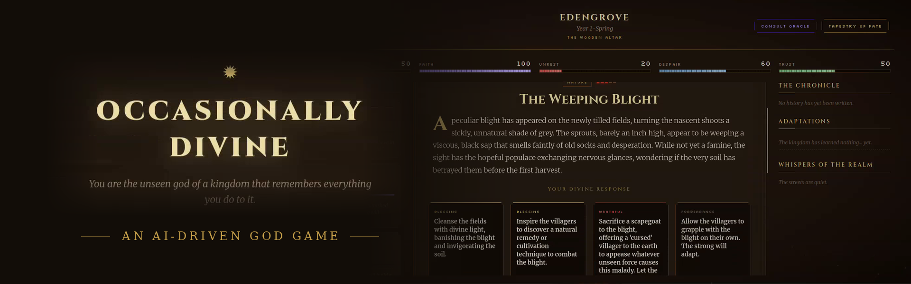

# Occasionally Divine

*A god-simulator where the kingdom **remembers** — powered by a [Cognee](https://www.cognee.ai) knowledge graph.*

You are the invisible god of a struggling medieval kingdom. Each season brings a crisis; you answer with miracles, subtle nudges, wrathful judgments — or silence. The twist: **nothing is forgotten.** Every choice is woven into a knowledge graph, and the world generates its future out of its memory of you.

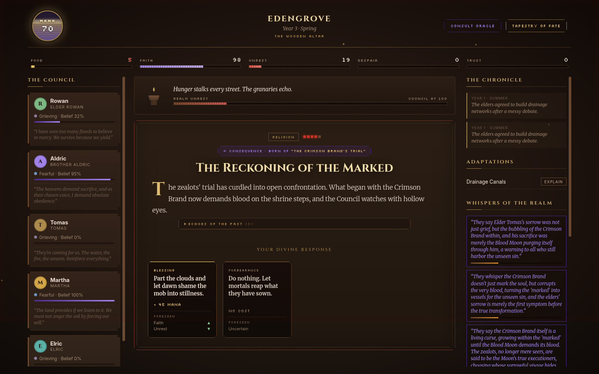

## Why memory is the game

Most LLM games have goldfish memory: every scene is generated fresh, so nothing you do matters for long. *Occasionally Divine* inverts that — the memory **is** the gameplay:

- **Causal chains.** Crises descend from earlier crises. A drought you ignored becomes a famine, becomes a witch hunt, becomes a zealot uprising — each new situation carries a `⟴ CONSEQUENCE` badge naming its ancestor, and the full chain is browsable as a tree in the **Tapestry of Fate**.
- **Adaptations that actually protect.** When unrest boils over, the Council of Elders convenes, debates (in character, holding grudges retrieved from the graph), and builds an adaptation — drainage canals, granaries, watch posts. Seasons later, when a matching calamity strikes, the adaptation **mechanically halves the damage** and the UI celebrates it:

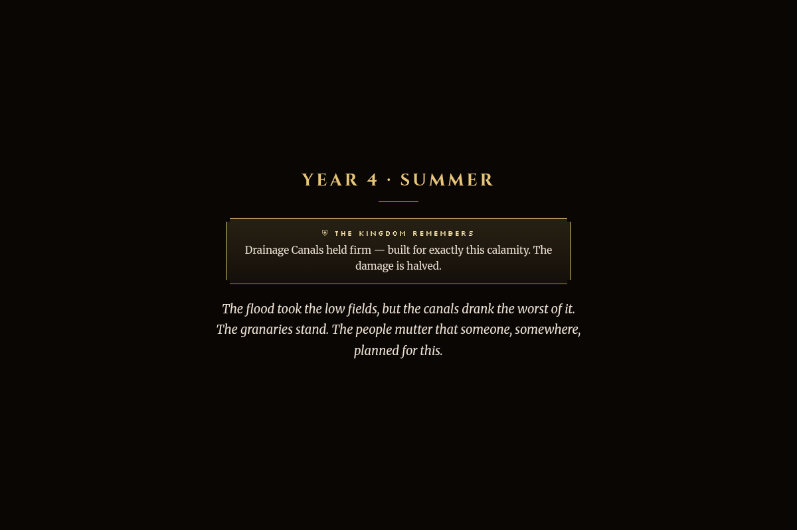

- **Rumors that evolve into legends.** Each crisis seeds a rumor among the commoners. Rumors link to parent rumors, mutate across seasons, and can eventually culminate as real crises — a fabled beast "discovered," a cult uprising, a witch trial.
- **Elders who catch on.** Five elders with persistent personalities, moods, and beliefs. Their suspicion that *something unseen is manipulating the kingdom* is tracked in the graph and slowly surfaces in council debates. They're talking about **you**.
- **Transparent retrieval.** Every situation ships with an **"Echoes of the Past"** panel showing the raw memories Cognee retrieved to generate it — the graph's work is visible, not vibes.

## In motion

The Council debates in character — grudges and all — then proposes an adaptation drawn straight from the graph:

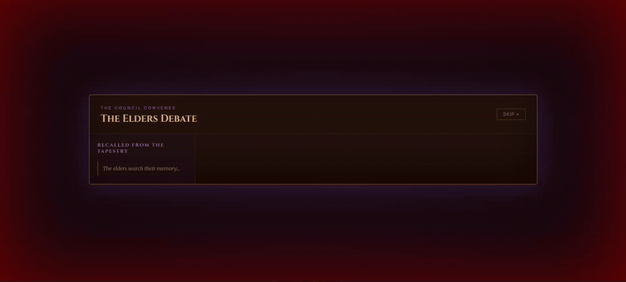

Ask the Oracle of the Archives anything; it answers from the same graph the game plays out of:

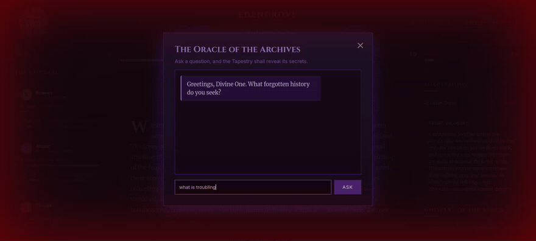

## Screenshots

<details>
<summary>More of the interface — the dashboard, seasonal turns, the council, and the archive (click to expand)</summary>

| | |
|---|---|
| 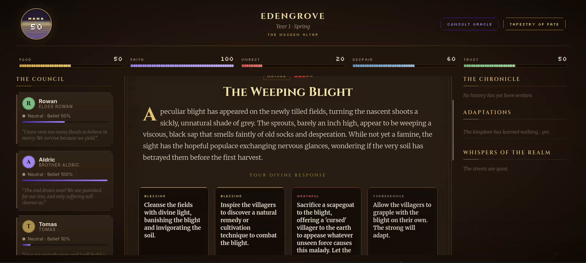 | 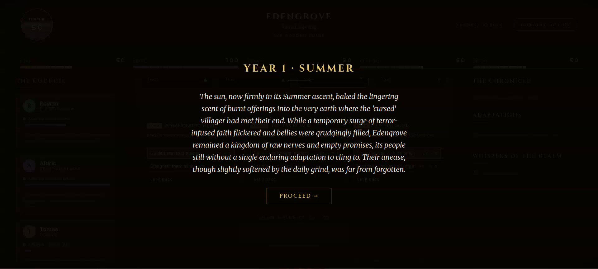 |
| 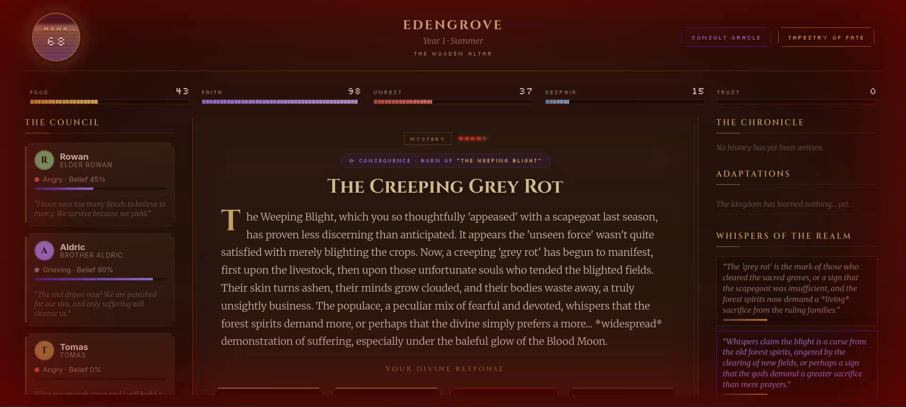 | 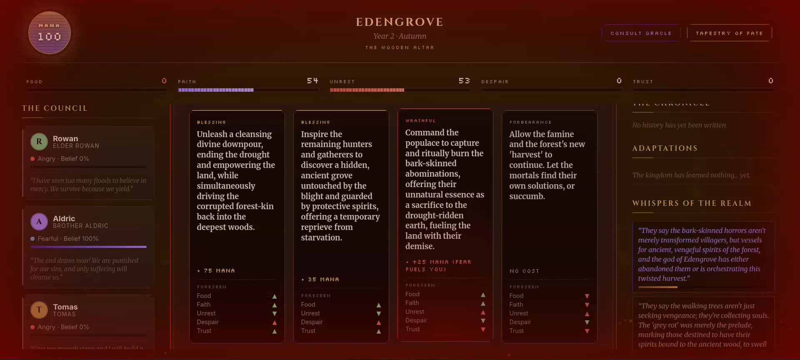 |
| 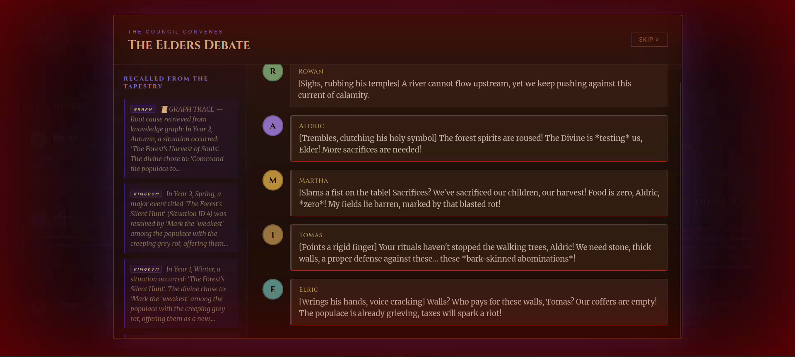 | 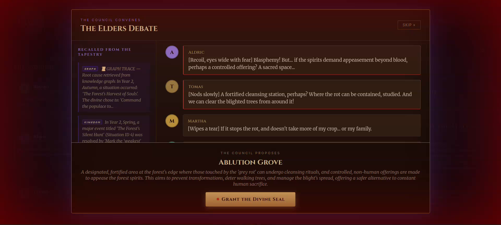 |
| 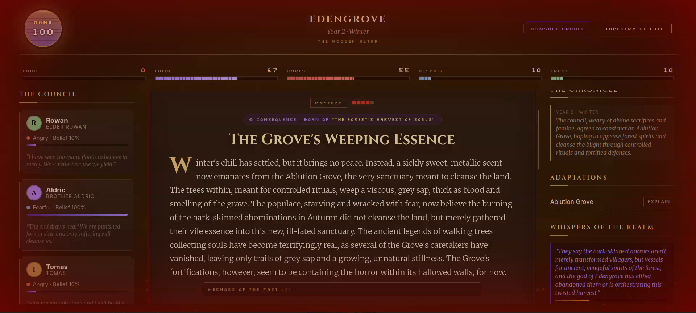 |  |
| 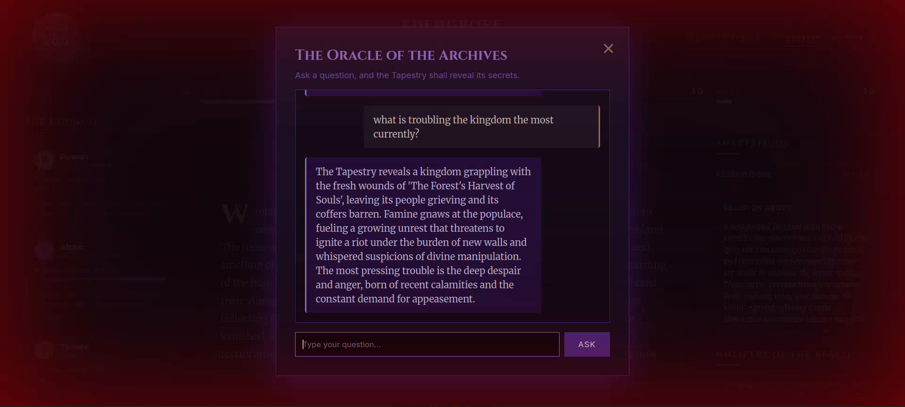 | |

</details>

## Architecture

Two memory systems, deliberately split — like a mind:

```mermaid
flowchart LR
    subgraph Conscious["Conscious mind — SQL (SQLite + SQLAlchemy)"]
        K[Kingdom state<br/>stats · weather · omens]
        S[Situations<br/>parent_situation_id chains]
        E[Elders · Rumors · Adaptations<br/>Chronicle · Council meetings]
    end

    subgraph Subconscious["Subconscious — Cognee knowledge graph (kuzu + lancedb)"]
        D1[kingdom_history]
        D2[elder_history]
        D3[rumor_history]
        D4[disaster_history]
        D5[relationship_history]
        D6[external_world_history]
    end

    P[Pydantic memory schemas<br/>SituationMemory · AdaptationMemory<br/>ElderActionMemory · RumorMemory · …] -- "to_sentence() → cognee.add()" --> Subconscious
    Conscious --> P
    Subconscious -- "targeted natural-language<br/>interrogations at generation time" --> G[Situation Engine /<br/>Council Engine<br/>Gemini 2.5 Flash-Lite]
    Conscious --> G
    G -- "validated causal links,<br/>new state, new memories" --> Conscious
```

**The flow, per turn:**

1. **Generate** — the Situation Engine pulls SQL state (stats, recent events, active rumors) *plus* targeted Cognee interrogations chosen by game state (low food → famine history; high unrest → dissent history; storms → disaster history). Recent situation IDs are injected so the LLM can declare a **validated** causal parent — hallucinated IDs are rejected before persisting.
2. **Intervene** — the player picks one of four responses (miracle / nudge / wrath / nothing). Effects apply to SQL state; **completed adaptations matching the crisis category mechanically dampen the harm** — no trusting the LLM to remember.
3. **Remember** — the resolution is written back as structured Pydantic memories rendered to natural-language sentences (`SituationMemory`, with its ID and its parent's ID) so the graph accumulates *causal*, ID-bearing facts, not keyword soup.

### Cost-engineering (it's a paid API)

- **`SearchType.CHUNKS` retrieval, not `GRAPH_COMPLETION`** — retrieval is embedding + graph lookup only (local Ollama embeddings, zero paid calls); synthesis happens once in the generator LLM instead of once per search. Saves ~9–12 paid calls per turn.
- **Batched `cognify`** — the expensive graph-compile pass runs every 3rd trigger (or forced after narratively-critical council meetings), with pending datasets accumulated so nothing is dropped.
- **Local embeddings** — `nomic-embed-text` via Ollama; the only paid model is Gemini Flash-Lite for generation.
- **Persisted situations** — refresh-proof localStorage + SQL persistence so a page reload never re-bills a generation.

## Running it

**Prereqs:** Python 3.12+, [Ollama](https://ollama.com) with `nomic-embed-text` pulled, a Gemini API key.

```bash
# 1. Backend
cd backend
python -m venv venv && source venv/bin/activate
pip install -r requirements.txt

# 2. Environment — create backend/.env
#    GEMINI_API_KEY=<your key>
#    DATABASE_URL=sqlite:///./occasionally_divine.db   (default; optional)
#    OLLAMA_URL=http://localhost:11434                 (default; optional)

# 3. Ollama embeddings (local, free)
ollama pull nomic-embed-text

# 4. Run — serves both the API and the frontend
uvicorn main:app --port 8000
# open http://localhost:8000
```

A pre-played save with a rich causal history is included as `backend/demo_seed.db` — copy it over `backend/occasionally_divine.db` to start from a kingdom that already has a past. (The SQL side — causal chains, chronicle, rumors, adaptations — ships fully; the Cognee graph rebuilds locally as you play, since graph stores are machine-local.)

## Tech

| Layer | Choice |
|---|---|
| Memory graph | **Cognee** (kuzu graph DB + lancedb vectors), 6 datasets |
| Game state | FastAPI · SQLAlchemy · SQLite |
| Generation | Gemini 2.5 Flash-Lite (via Cognee's LLM config + direct client) |
| Embeddings | nomic-embed-text via Ollama (local) |
| Frontend | Vanilla JS/HTML/CSS — no build step; "Majestic Paranoia" design system with pixel accents |

## The pitch, in one line

> SQL remembers what the kingdom *is*; Cognee remembers what the kingdom *has been through* — and the game is what happens when the second one talks back.
